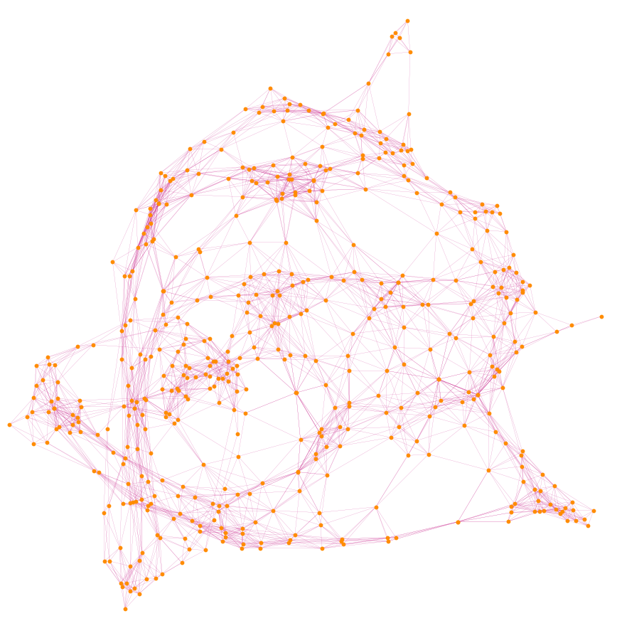

MathemaTCSへようこそ. このページでは理論計算機科学にまつわる様々なトピックを解説していきます.

> **定義.**
> 有限集合$V$に対し,
> $$
\begin{align*}
  ax=b
\end{align*}
> $$
> を満たす

  
証明

  $ax=b$なのでこれならいけるかも分からん.
  マークダウンも使える?
  **わからん**

  > hoge
  > $Ax$

  よって
  $$
  \begin{align*}
    ax &= b \\
    &= c
  \end{align*}
  $$

こっちは?
 この図では

アルゴリズムの内部では...

