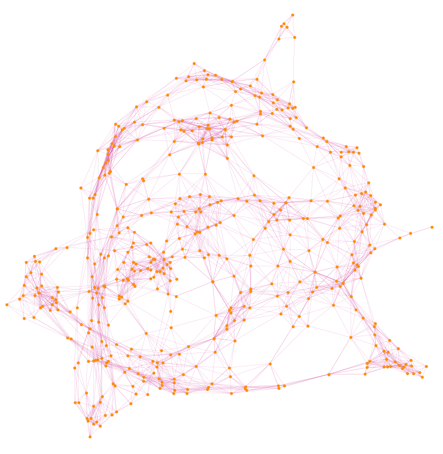

[ホーム](../readme.md) / [第1回](./)
# グラフとは?

グラフとはネットワークの構造を抽象化した離散構造です.

</img>

有限集合$V$と自然数$k\in \mathbb{N}$に対し, $V$の$k$個の要素からなる部分集合の全体を$\binom V k$ とします.
すなわち
$$
  \begin{align*}
    \binom V k = \left\{ S \subseteq V \colon |S|=k\right\}
  \end{align*}
$$

です.

> **定義.**
> 非空な有限集合$V$と$E \subseteq \binom V 2$ の組$G=(V,E)$を**グラフ**という.
> - グラフ$G=(V,E)$に対し, 集合$V,E$をそれぞれ**頂点集合**, **辺集合**と呼び, それらの要素をそれぞれ**頂点**, **辺**と呼ぶ.
> - グラフ$G$の頂点集合と辺集合をそれぞれ$V(G),E(G)$で表す.
> - 頂点$v$と辺$e$が$v\in e$を満たすとき, $v$は$e$に**接続している**という.
> - 二つの頂点$u,v$が$\left\{ u,v \right\} \in E$を満たすとき, $u$と$v$は**隣接している**という.

## 例1

</img>

上の図で表されるグラフは

$$
  \begin{align*}
    &V = \left\{ 1,2,3,4 \right\},\\
    &E = \left\{ \left\{ 1,2 \right\}, \left\{ 2,3 \right\},\left\{ 1,3 \right\},\left\{ 3,4 \right\} \right\}
  \end{align*}
$$
で表されます.

## 例2

</img>

上の図で表されるグラフは

$$
  \begin{align*}
    &V = \left\{ 1,2,3,4,5,6 \right\},\\
    &E = \left\{ \left\{ 1,2 \right\},\left\{ 2,3 \right\},\left\{ 1,3 \right\},\left\{ 4,5 \right\} \right\}
  \end{align*}
$$
です.
